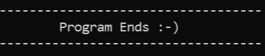

# 🏦 Project 2: Bank System Management

A C++ console application for managing bank clients with full CRUD operations and file storage.

## ✨ Features
- Add new clients
- Display all clients
- Search client by account number
- Update client information
- Delete client
- Deposit and Withdraw
- Show total balances
- Data stored in `Clients.txt`

## 🛠️ Technologies
- C++
- File Handling
- Vector

## 🚀 How to Run
1. Clone the repository:
   ```bash
   git clone https://github.com/abdulrahamanharitani-ai/Project-2-Bank-System-Management.git
2.Open the project in Visual Studio 2022.
3.Build and run (Ctrl + F5).

Author
Abdulrahman Al-Haritani
GitHub: abdulrahamanharitani-ai

## 📸 Screenshots

### Main Menu


### Add New Client


### Client List


### Find Client


### Update Client


### Delete Client


### Deposit


### Withdraw


### Total Balances


### Transactions Menu


### Exit


